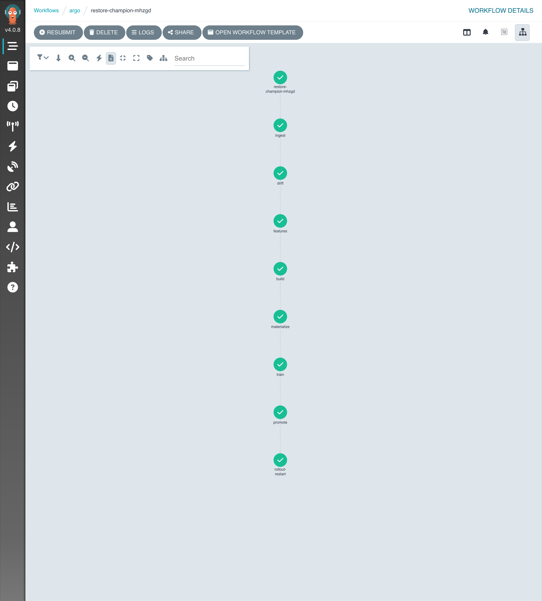
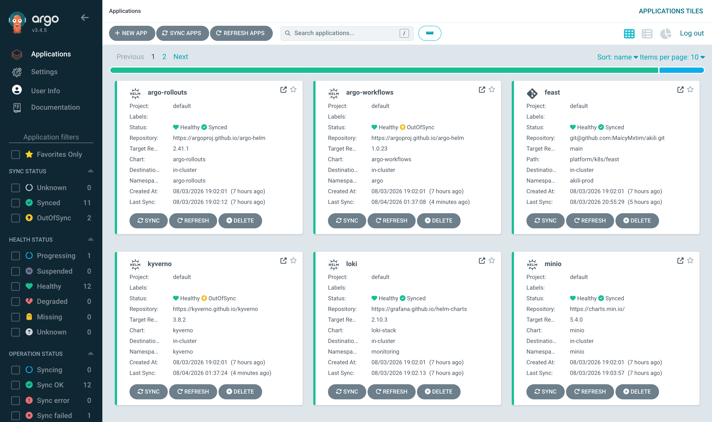
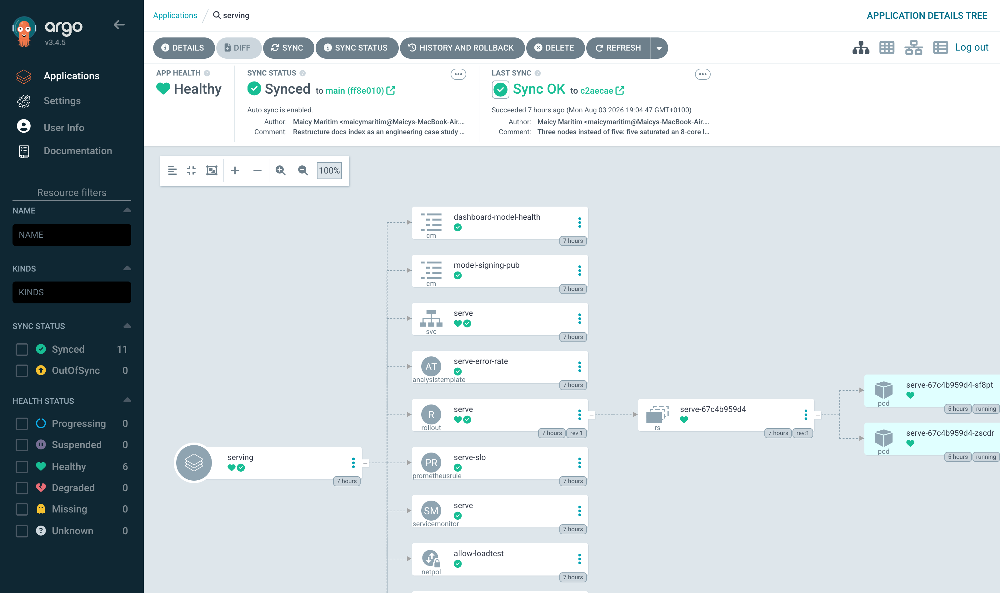
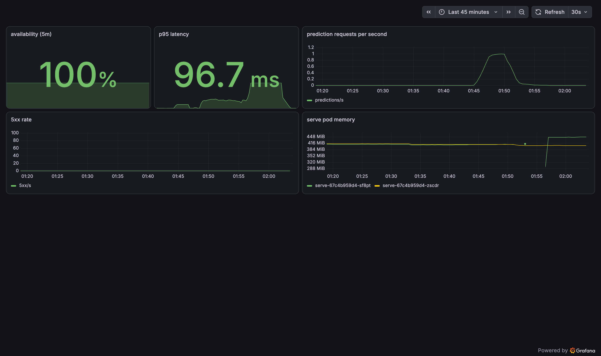
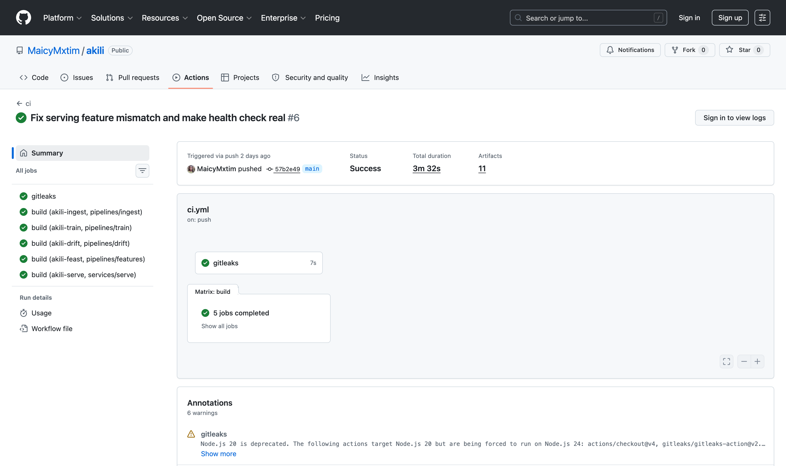

# Akili Platform

An MLOps platform running on Kubernetes. It trains a machine learning model, decides whether the new version should replace the live one, deploys it without downtime, and watches for the data changing underneath it. The whole cycle runs without a person involved.

## Executive summary

| | |
|---|---|
| **Problem** | Keeping a machine learning model in production means retraining, evaluating, releasing and monitoring it, and doing each step by hand makes every one of them a risk. |
| **Solution** | A Kubernetes platform where pipelines retrain the model, a gate promotes only a better model, canary rollouts release it, and drift checks watch the data. |
| **Workload** | UK house price prediction from 780,000 Land Registry records, kept simple on purpose so the platform is the interesting part. |
| **Runs on** | A 3-node k3d cluster on a laptop, rebuilt from the repository with two commands. |
| **Source** | [github.com/MaicyMxtim/akili](https://github.com/MaicyMxtim/akili) |

Key outcomes:

- The month-end cycle, from new data to a deployed model, runs end to end with nobody watching.
- 449 of 450 requests were answered while five failures were caused deliberately during live traffic.
- Training is reproducible to the pound: two runs of the same configuration both scored £93,229 mean absolute error.
- Models and images are signed, and the cluster and the serving pods verify those signatures before running anything.

## The problem

A model in production decays. New data arrives every month, the world drifts away from the training set, and each retrain raises the same questions: is the new model actually better, how does it reach production safely, and how would anyone notice if it went wrong?

Answering those questions by hand is slow and error-prone, so this platform automates each one and then tests the automation by making things fail on purpose. The budget was zero, which put the whole platform on a laptop. Everything else about it works the way it would on a cloud cluster.

## Architecture

<svg viewBox="0 0 780 440" xmlns="http://www.w3.org/2000/svg" role="img" aria-label="Akili Platform architecture diagram" style="width:100%;height:auto;background:#fafafa;border:1px solid #e1e4e8;border-radius:8px;margin:8px 0 16px">
<style>
.ak-box{fill:#ffffff;stroke:#c6cbd1;stroke-width:1}
.ak-boxa{fill:#e6f2ee;stroke:#1f6f5c;stroke-width:1}
.ak-zone{fill:none;stroke:#959da5;stroke-width:1;stroke-dasharray:5 4}
.ak-t{font-family:SFMono-Regular,Consolas,monospace;font-size:11.5px;fill:#24292e}
.ak-s{font-family:SFMono-Regular,Consolas,monospace;font-size:10px;fill:#6a737d}
.ak-a{font-family:SFMono-Regular,Consolas,monospace;font-size:11px;fill:#1f6f5c}
.ak-line{stroke:#6a737d;stroke-width:1.2;fill:none}
</style>
<defs>
<marker id="akarr" viewBox="0 0 10 10" refX="9" refY="5" markerWidth="7" markerHeight="7" orient="auto-start-reverse">
<path d="M 0 0 L 10 5 L 0 10 z" fill="#6a737d"/>
</marker>
</defs>
<rect x="20" y="20" width="740" height="330" rx="12" class="ak-zone"/>
<text x="740" y="44" text-anchor="end" class="ak-s">k3d · 3 nodes · state reconciled from Git by Argo CD</text>

<rect x="44" y="60" width="300" height="48" rx="8" class="ak-box"/>
<text x="194" y="80" text-anchor="middle" class="ak-t">Argo Workflows</text>
<text x="194" y="96" text-anchor="middle" class="ak-s">ingest · features · train · promote · drift</text>

<rect x="374" y="60" width="180" height="48" rx="8" class="ak-box"/>
<text x="464" y="80" text-anchor="middle" class="ak-t">MinIO storage</text>
<text x="464" y="96" text-anchor="middle" class="ak-s">data · models · signatures</text>

<rect x="584" y="60" width="160" height="48" rx="8" class="ak-box"/>
<text x="664" y="80" text-anchor="middle" class="ak-t">MLflow</text>
<text x="664" y="96" text-anchor="middle" class="ak-s">tracking · registry</text>

<line x1="344" y1="84" x2="372" y2="84" class="ak-line" marker-end="url(#akarr)"/>
<line x1="554" y1="84" x2="582" y2="84" class="ak-line" marker-end="url(#akarr)"/>

<rect x="44" y="150" width="200" height="48" rx="8" class="ak-box"/>
<text x="144" y="170" text-anchor="middle" class="ak-t">Feast features</text>
<text x="144" y="186" text-anchor="middle" class="ak-s">history in parquet · live in Redis</text>

<rect x="274" y="150" width="220" height="48" rx="8" class="ak-boxa"/>
<text x="384" y="170" text-anchor="middle" class="ak-a">serving API</text>
<text x="384" y="186" text-anchor="middle" class="ak-s">verifies model signature on start</text>

<rect x="524" y="150" width="220" height="48" rx="8" class="ak-box"/>
<text x="634" y="170" text-anchor="middle" class="ak-t">Argo Rollouts</text>
<text x="634" y="186" text-anchor="middle" class="ak-s">canary release · auto-rollback</text>

<line x1="244" y1="174" x2="272" y2="174" class="ak-line" marker-end="url(#akarr)"/>
<line x1="524" y1="174" x2="496" y2="174" class="ak-line" marker-end="url(#akarr)"/>
<line x1="620" y1="108" x2="475" y2="148" class="ak-line" marker-end="url(#akarr)"/>
<text x="562" y="132" text-anchor="middle" class="ak-s">champion pointer</text>

<rect x="44" y="240" width="280" height="48" rx="8" class="ak-box"/>
<text x="184" y="260" text-anchor="middle" class="ak-t">Prometheus · Grafana · Loki</text>
<text x="184" y="276" text-anchor="middle" class="ak-s">error-budget alerts · runbooks</text>

<rect x="354" y="240" width="170" height="48" rx="8" class="ak-box"/>
<text x="439" y="260" text-anchor="middle" class="ak-t">Evidently</text>
<text x="439" y="276" text-anchor="middle" class="ak-s">monthly drift checks</text>

<rect x="554" y="240" width="190" height="48" rx="8" class="ak-boxa"/>
<text x="649" y="260" text-anchor="middle" class="ak-a">Kyverno admission</text>
<text x="649" y="276" text-anchor="middle" class="ak-s">signed images only</text>

<rect x="20" y="380" width="740" height="36" rx="8" class="ak-box"/>
<text x="390" y="402" text-anchor="middle" class="ak-s">runs on a laptop · £0 · rebuilds from the repository with two commands</text>
</svg>

Three Kubernetes nodes run as containers using k3d, one for the control plane and two for workloads. Argo CD reads the repository and makes the cluster match it, so anything deleted by accident is put back within seconds. The platform was rebuilt from the repository three times during development.

## The month-end cycle

```
new Land Registry data published
        │
ingest          download · validate against a schema · write parquet to MinIO
        │
drift check     compare the new month against the training reference
        │
features        recompute area statistics · publish current values to Redis
        │
train           fit a new model · log everything to MLflow
        │
promotion gate  score against the champion on the same held-out data
        │       a better model is signed and promoted · anything else is refused
        │
restart         the rollout brings the new model in gradually, watching error rates
```

This cycle was run twice, end to end. The first run trained a model that tied the champion exactly and the gate refused it, which is correct behaviour. The second run promoted, signed and released a new model gradually behind the canary checks. Neither run needed a person.



*A real month-end run in Argo Workflows. Every step completed: ingest, drift check, feature build, materialise, train, promote and a rollout restart.*

## The platform in operation



*Argo CD manages every platform component as an application and reconciles the cluster from the repository. This is the whole platform: rollouts, workflows, storage, tracking, features, serving, monitoring and policy.*



*The serving application's resource tree: the rollout, its replica set and both serving pods, alongside the network policy, service monitor, SLO rules and the signed model configuration.*



*The model health dashboard during a live traffic run: availability, p95 latency, prediction rate, error rate and per-pod memory.*



*A CI run building, scanning and signing all six images. This particular run shipped the fix from the silent outage postmortem, the health check that makes a real prediction.*

## Design decisions

**A gate between training and production.** A new model is promoted only when it beats the live champion on the same held-out data. The registry holds one name, `champion`, that training moves and serving reads, so the two sides stay decoupled.

**Point-in-time correct features.** Feast defines each feature once and serves history to training and current values to inference. Asking for a postcode's statistics at three different sale dates returns three different historical values, so a model trains only on what was knowable at the time. This is the property that keeps offline scores honest.

**Canary releases with automatic rollback.** Argo Rollouts replaces half the pods, pauses, and reads live error rates before continuing. When progress stalls or the numbers are bad, it destroys the new pods and leaves the old ones serving.

**Signatures on models as well as images.** CI signs every container image and Kyverno verifies it at admission. The promotion step signs every model, and the serving pod verifies that signature before loading. Tampering with either is caught before anything runs.

**Validation bounds that describe corruption.** Real Land Registry data contains £1 transfers and a £793 million portfolio sale, and earlier, stricter bounds rejected both. The schema now encodes what corruption looks like, and genuine outliers pass.

## Evidence

Each claim below was tested by causing the failure on purpose and recording what happened.

**Bad data is rejected before storage.** A copy of a real monthly file was corrupted with 200 negative prices and 50 invalid property types. The ingest job refused the whole file and wrote a report naming each failing row, column and rule. The same job accepts the genuine file of 90,287 rows.

**Training is repeatable.** The same configuration on the same data was trained twice and produced £93,229 mean absolute error both times, identical to the pound. A fixed seed and a logged data path enforce this.

**The gate refuses weak models.** A model trained deliberately badly scored £102,737 against the champion's £93,229. The gate refused it, tagged the run, and stopped the pipeline with the champion untouched.

**Bad releases roll back on their own.** The serving deployment was pointed at a model version that does not exist. The new pod crashlooped, the rollout controller destroyed it and kept the old pods serving. A script requesting predictions every 0.4 seconds received a valid price throughout.

**Features match between training and serving.** For postcode area BS3, the training store and the serving store both returned a median price of £408,750 over 44 sales, and the training store returned correct historical values for three earlier dates.

**Drift is detected.** December 2025 against June 2026 passed with a distribution score of 0.02 against a threshold of 0.5. A synthetic file with every price tripled moved every monitored column, and the check failed and wrote a report.

**Unsigned images are blocked.** A pod referencing an unsigned image digest was refused by the cluster, which named the policy that rejected it. The same pod with a signed image is admitted normally.

**Tampered models are caught.** The stored signature for the live model was edited so its digest no longer matched the files. The next pod to start found the mismatch and refused to become ready, reporting "model v3 digest mismatch: artifact was modified after signing". Its sibling pod kept answering requests, so the service stayed up.

## Reliability

Five failures were caused on purpose while a request stream was running. 449 of 450 requests were answered.

| Failure | Requests | Failed |
|---|---|---|
| Serving pod killed | 90 | 0 |
| Node drained | 90 | 1 |
| Feature store stopped | 90 | 0 |
| Tracking server stopped | 90 | 0 |
| Tracking database killed | 90 | 0 |

The single failed request during the node drain happened in the gap between the pod being told to stop and the load balancer removing it from rotation. The standard fix is a short delay before shutdown.

Stopping the tracking server produced the most useful finding. Predictions carried on because each pod holds its model in memory, but a pod deleted during that window could not start again, because startup reads the live model pointer from the tracking server. The outage stays invisible until something restarts, and then it is total. Full details are in the [chaos experiments](https://github.com/MaicyMxtim/akili/blob/main/runbooks/chaos/experiments.md).

## Incidents

Four real incidents happened during the build, and each has a written [postmortem](https://github.com/MaicyMxtim/akili/tree/main/runbooks/postmortems). The most instructive one: every prediction failed for ninety minutes while the platform reported itself healthy, because the health check only confirmed a model object existed and the release check saw no errors in the absence of traffic. The health check now makes a real prediction.

The model itself produced a finding worth recording. The area price features from the feature store made it slightly worse, £95,602 against £93,229, and that negative result is kept in the record.

## Model results

| Metric | Value |
|---|---|
| Mean absolute error | £93,229 |
| Median error | 18.07% |
| Training rows | 780,000 |
| Test set | held-out month |

The public records contain no floor area and no condition, so this error is close to the limit of what the data supports. The model is kept simple on purpose so that the platform is the interesting part.

## Costs

| Option | Monthly |
|---|---|
| This platform, on a laptop | £0 |
| Self-hosted on one cloud server | £25 to £30 |
| Bought as managed services | £650 to £700 |

Orchestration and monitoring are most of the managed bill. Training the model costs a few pence of compute. The full comparison is in the [cost report](unit-economics.html).

## What I would improve

- Cache the champion model pointer locally, so pods can restart while the tracking server is down. The chaos experiments showed this is the platform's sharpest edge.
- Add a short pre-stop delay to the serving pods, which removes the one failed request seen during a node drain.
- Investigate area features further, since the current set made the model worse and a feature store earns its place when its features help.
- Move the cluster to real multi-node hardware and add the resource pressure that a laptop hides.

## Lessons learned

- A health check earns its place by exercising the real path. Checking that a model object exists reported a healthy platform through a ninety-minute total outage.
- Reliability claims become facts when the failure is caused deliberately and the result is recorded.
- Point-in-time correctness in the feature store is what makes offline scores trustworthy.
- Validation bounds work best when they describe corruption, because real data contains genuine extremes.
- Negative results are worth keeping. The feature that made the model worse taught more than another feature that helped slightly.

## Further reading

1. [Walkthrough](walkthrough.html). How the platform is built and what happens when it runs.
2. [Cost report](unit-economics.html). What the same platform costs as managed services.
3. [Chaos experiments](https://github.com/MaicyMxtim/akili/blob/main/runbooks/chaos/experiments.md). Five deliberate failures and their results.
4. [Postmortems](https://github.com/MaicyMxtim/akili/tree/main/runbooks/postmortems). Four real incidents from the build.
